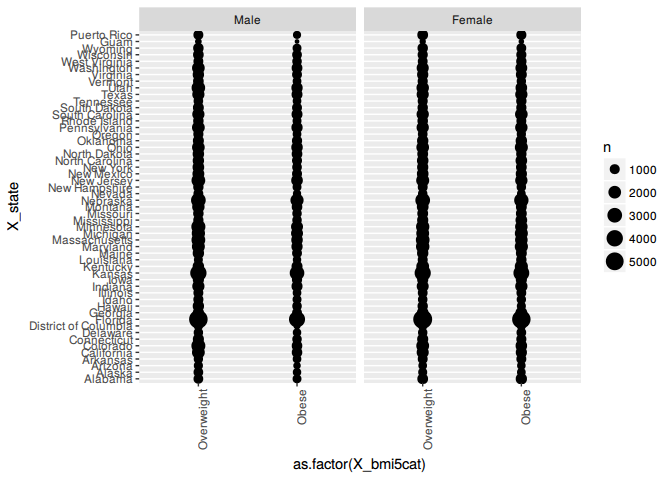
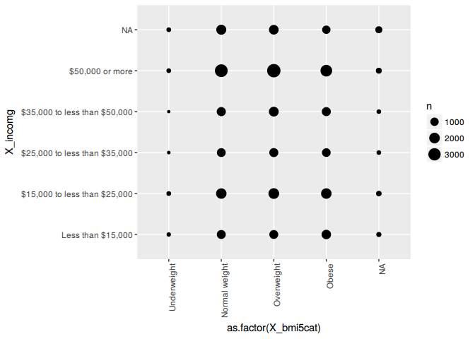
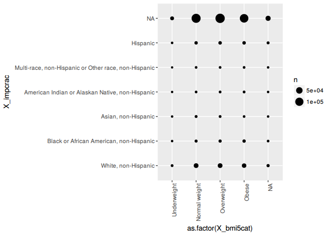
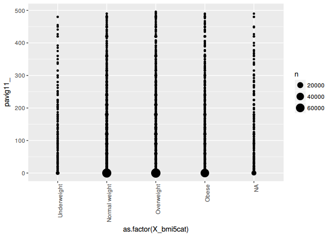
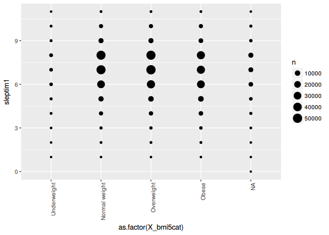
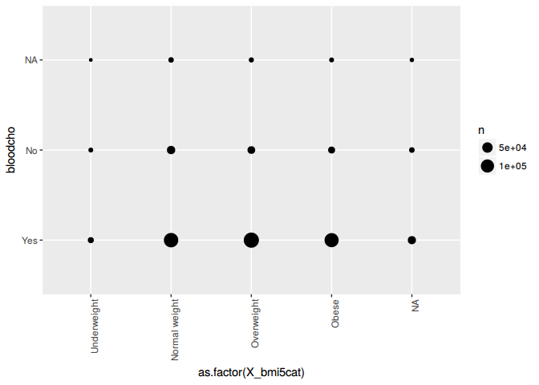
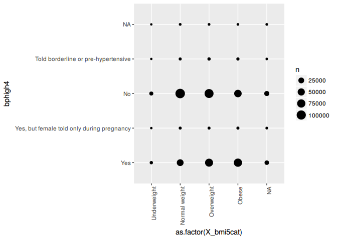
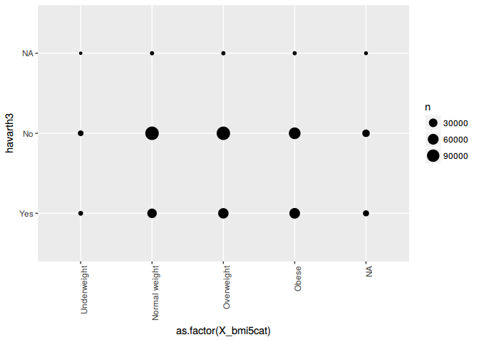

Exploring the BRFSS data
================

Setup
-----

### Load packages

``` r
library(ggplot2)
library(dplyr)
```

### Load data

Make sure your data and R Markdown files are in the same directory. When loaded your data file will be called `brfss2013`. Delete this note when before you submit your work.

``` r
load("~/coursera/dataproject/brfss2013.RData")
```

------------------------------------------------------------------------

Part 1: Data
------------

The Behavioral Risk Factor Surveillance System (BRFSS) is the nation's premier system of health-related telephone surveys that collect state data about U.S. residents regarding their health-related risk behaviors, chronic health conditions, and use of preventive services. Established in 1984 with 15 states, BRFSS now collects data in all 50 states as well as the District of Columbia and three U.S. territories. BRFSS completes more than 400,000 adult interviews each year, making it the largest continuously conducted health survey system in the world. By collecting behavioral health risk data at the state and local level, BRFSS has become a powerful tool for targeting and building health promotion activities. As a result, BRFSS users have increasingly demanded more data and asked for more questions on the survey

------------------------------------------------------------------------

Part 2: Research questions
--------------------------

**Research quesion 1:** How many people of the interviewed are overweight and obese people by state and which state has the most?

Examining this question should answer which state has the most overweight and obese people. By indentifying try to answer further research question only by considering this specific state.

**Research quesion 2:** Can one characterize somehow what kind of people or circumstances are effecting overweight or obesity?

Examine several factors, like sleep time, residence and so on to see if they effect obesity or overweight.

**Research quesion 3:** Can one examine any of the well known side effects of obesity and overweight from the data?

Everybody knows that overweight and obesity has health issues. Lets examine this issuses and try to correlate them with obesity to see if the doctors are "right".

------------------------------------------------------------------------

Part 3: Exploratory data analysis
---------------------------------

**Research question 1:** Lets see which state has the most obese or overweight people. Maybe the obesity can be correlated with the richness of the state.

``` r
ob <- brfss2013 %>% filter(X_bmi5cat == "Overweight" | X_bmi5cat == "Obese")
ggplot(data=ob, aes(x=as.factor(X_bmi5cat), y=X_state)) + geom_count()+facet_grid(. ~ sex)+ theme(axis.text.x = element_text(angle = 90, hjust = 1))
```

 It looks like Florida wins the race. Extract the exact count of people.

``` r
bmi.cnt <- count(brfss2013, X_state, X_bmi5cat)

max_obese <- max((bmi.cnt %>% filter(X_bmi5cat == "Obese"))$n) #%>% summarise(maxx = max(n), fat = X_bmi5cat) 
max_overw <- max((bmi.cnt %>% filter(X_bmi5cat == "Overweight"))$n)

bmi.cnt[bmi.cnt$n == max_obese,]
```

    ## # A tibble: 1 x 3
    ##   X_state X_bmi5cat     n
    ##    <fctr>    <fctr> <int>
    ## 1 Florida     Obese  9315

``` r
bmi.cnt[bmi.cnt$n == max_overw,]
```

    ## # A tibble: 1 x 3
    ##   X_state  X_bmi5cat     n
    ##    <fctr>     <fctr> <int>
    ## 1 Florida Overweight 11414

So Florida wins, comparing Floridas wealthness with other states (<https://en.wikipedia.org/wiki/List_of_U.S._states_by_income>), we see Florida on place 37 which is in the last third of the poorest states.

Let's move to research question 2 and examine several factors for obesity.

**Research question 2:** As we have concluded in question 1 the richness of the state does not correlate with obesity. Lets check the income in Florida.

``` r
florida <- brfss2013 %>% filter(X_state == "Florida")
ggplot(data=florida, aes(x=as.factor(X_bmi5cat), y=X_incomg)) + geom_count()+ theme(axis.text.x = element_text(angle = 90, hjust = 1))
```

 What one can see is that with higher income there are more obese people, that is clear, as more money more food. Next move on to check for race.

``` r
ggplot(data=brfss2013, aes(x=as.factor(X_bmi5cat), y=X_impcrac)) + geom_count()+ theme(axis.text.x = element_text(angle = 90, hjust = 1))
```

 There is a slide tendency for white people to become obese but not evident. Move to the last observation and check for physical avctivity per week.

``` r
phys <- brfss2013 %>% filter(pavig11_ < 500)
ggplot(data=phys, aes(x=as.factor(X_bmi5cat), y=pavig11_)) + geom_count()+ theme(axis.text.x = element_text(angle = 90, hjust = 1))
```

 What clearly can be seen is that obese or overweight people are mostly not doing any physical activity. Which could be because of the obesity or the obesity came from not doing any activity.

Move on to question 3 and try to show some effects of obesity.

**Research question 3:** Lets see how obesity effects the sleep time of the observed people.

``` r
sleep <- brfss2013 %>% filter(sleptim1 < 12)
ggplot(data=sleep, aes(x=as.factor(X_bmi5cat), y=sleptim1)) + geom_count()+ theme(axis.text.x = element_text(angle = 90, hjust = 1))
```

 Surprisingly mostly of the obese and overweight people have the same sleep pattern as underweight and normal weight people. Lets examine the blood cholesterol.

``` r
ggplot(data=brfss2013, aes(x=as.factor(X_bmi5cat), y=bloodcho)) + geom_count()+ theme(axis.text.x = element_text(angle = 90, hjust = 1))
```

 Interesting that normal weight people in average have the same struggle with blood cholesterol as obese or overweight people. High blood pressure is again a symptomatic of obese people. Lets see its confirmed by the data.

``` r
ggplot(data=brfss2013, aes(x=as.factor(X_bmi5cat), y=bphigh4)) + geom_count()+ theme(axis.text.x = element_text(angle = 90, hjust = 1))
```

 There is a slight increase in blood pressure cases by overweight or obese people but not very significant. Lastly lets see what arthritis as factor says about obesity.

``` r
ggplot(data=brfss2013, aes(x=as.factor(X_bmi5cat), y=havarth3)) + geom_count()+ theme(axis.text.x = element_text(angle = 90, hjust = 1))
```

 Again not really an evidence that obese people have to struggle more with arthritis than normal weight people.

Conclusion
----------

Even with so much data it is hard to conclude, correlate well known facts with the underlying data. Everybody knows about the dangers of obesity but this data showed no real evidence of disadvantage of obese people vs. normal weight. Either the sample size was to small or the selection was not random enough.

References
----------

BRFSS Website: <http://www.cdc.gov/brfss/> (<http://www.cdc.gov/brfss/>)<br/> BRFSS Codebook: <http://www.cdc.gov/brfss/annual_data/2013/pdf/CODEBOOK13_LLCP.pdf>
